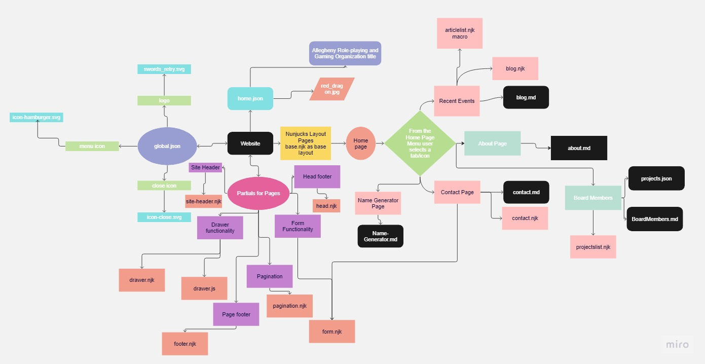
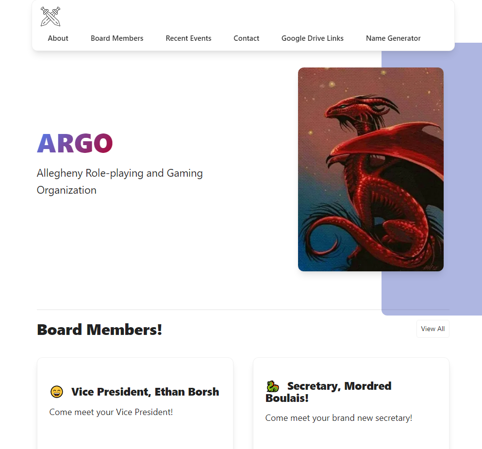
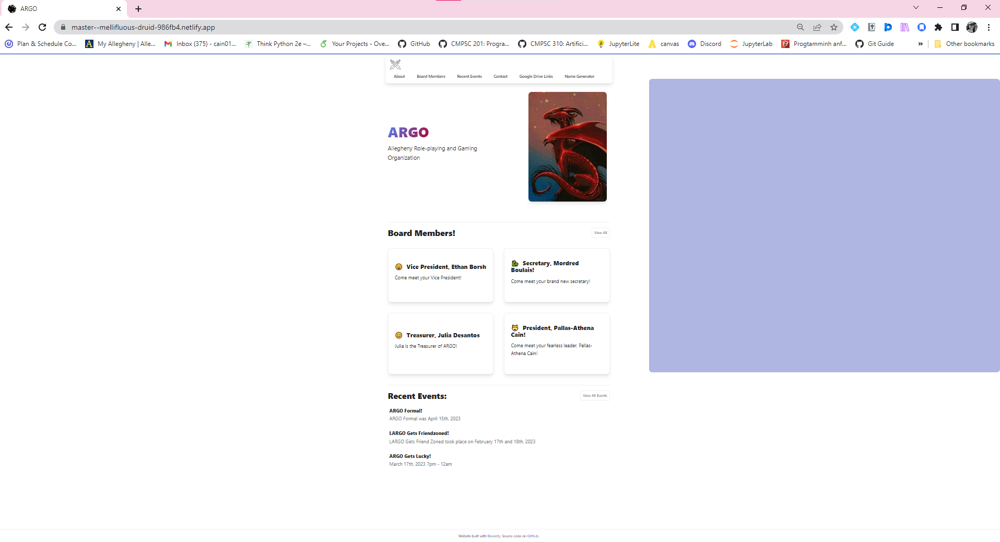
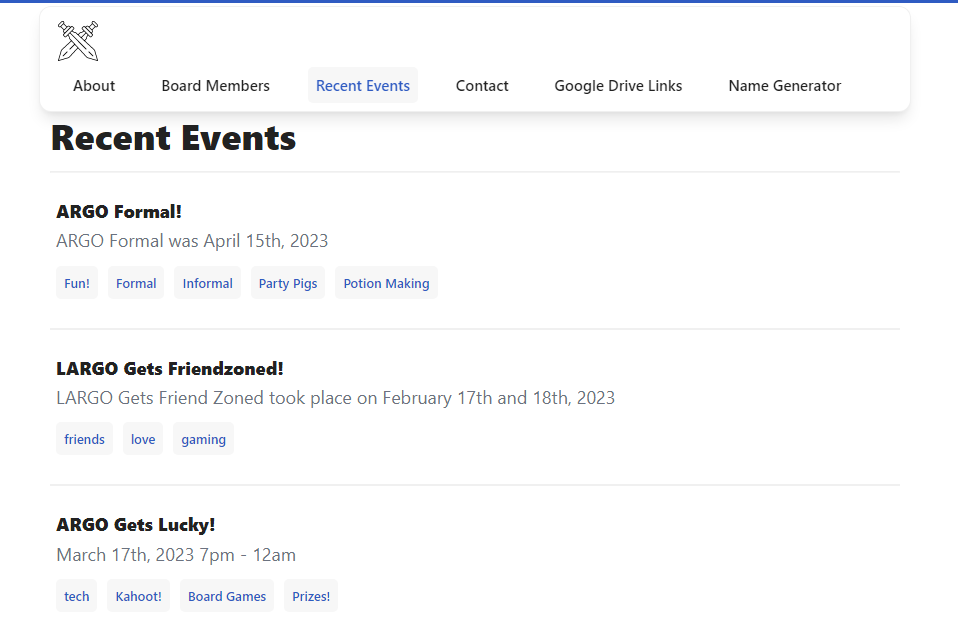

# Allegheny College Role-playing and Gaming Organization (ARGO) Club Website

## Report by Pallas Cain and Evelyn Griffith

Website Link: [https://alleghenyargo.netlify.app/](https://alleghenyargo.netlify.app/)

## Design of your project

## Implementation of your project

Our website includes languages such as JavaScript, SCSS, Nunjucks, Python, and a small amount of HTML. We are using the platform Netlify to help produce our website. We started with a Netlify template but had to customize and personalize it to fit our goals. We customized aspects such as the website icon, main image, the information on the board members/club, and the event articles. For some parts, we had to implement the entirety of it ourselves including a new page for the name generator and Google Drive links.

## Evaluation and Testing of your Program

#### Input (list directories and files with info)

In the `src/pages` directory:

- `about.md`
- `BoardMembers.md`
- `contact.md`
- `Inventory-and-google-drive.md`
- `Name-Generator.md`
- `RecentEvents.md`

In the `src/posts` directory:

- `customizations.md`
- `fifth_post.md`
- `fourthpost.md`
- `secondpost.md`
- `thirdpost.md`

In the `src/projects` directory:

- `first-project.md`
- `fourth-project.md`
- `second-project.md`
- `third-project.md`
- `vue-component.md`

#### Output (screenshots of the website)

#### Testing ( table of functionalities / put through application that tests user experience)

| Functionality                                                                  | Does it work? |
|--------------------------------------------------------------------------------|---------------|
| Global, Home button icon (swords)                                              | Yes           |
| Global, Pull-out menu with website pages ( When minimized )                    | Yes           |
| Global, tabs for each of the pages ( When full-screen)                         | Yes           |
| From main page, view all board members button takes to board members page      | Yes           |
| From main page, view all recent events button takes to recent events page      | Yes           |
| Google Drive Links page, links working                                         | Yes           |
| Name Generator page, Name Generator links working                              | Yes           |
| About page, Display information working                                        | Yes           |
| Recent Events page, Recent events articles displaying                          | Yes           |
| Recent Events page, Recent events tags back button working                     | Yes           |
| Meet the Board page, clickable board member buttons to specific member pages   | Yes           |
| Board member pages, View All Members button taking back to Meet the Board page | Yes           |
| From event article, back button to view all recent events                      | Yes           |
| Contact Page, Send a message to the club                                       | Yes           |

## Description of the challenges that you faced and how you resolved them

We had several bug fixes that had to be made with the redirecting buttons on the webpage. These included mostly the `back` buttons and the `view all` buttons. The reason they did not work was because they were attached to dead links that we had forgotten to change. We were able to fix them by going file by file and finding where the old unused link was and changing it to our new page titles.

Another big issue we ran into was with the name generator. Adding the Python code to the website was much more complicated than we anticipated and within the time constraints that we had to get the assignment done, we decided that it would be best to provide a link to a google colab space where people could run the name generator. This was ultimately the best decision for the project because if we had decided to implement the entire AI directly onto the website, it would have taken around 40 minutes to run. The users will still be able to generate their names, and they will also be able to see how some of the code itself works.

## If worked in a team, description of the way in which you and your team members shared the project workload

We split the workload in half when it came to customization and we made design choices as a team. All the photos and information on the club came directly from Pallas since she is the president. Pallas wrote all the details about the club to be put on the website. Evelyn worked a lot with making the different page structures work and adding the website's functionalities. She also figured out how to get the website running online through the Netlify platform.

Pallas made the AI that generated the names for the name_generator page of the website. Both of us had to work together to figure out how to make the name generator accessible to the public user, even though we opted to not put it directly onto our website, but rather use an outer source to implement the program. Pallas made the Google Colabs for the name generator programs and linked them. Pallas also worked on testing the website and making the website diagram. Pallas and Evelyn both worked on debugging the website and both were responsible for writing/editing the report.
